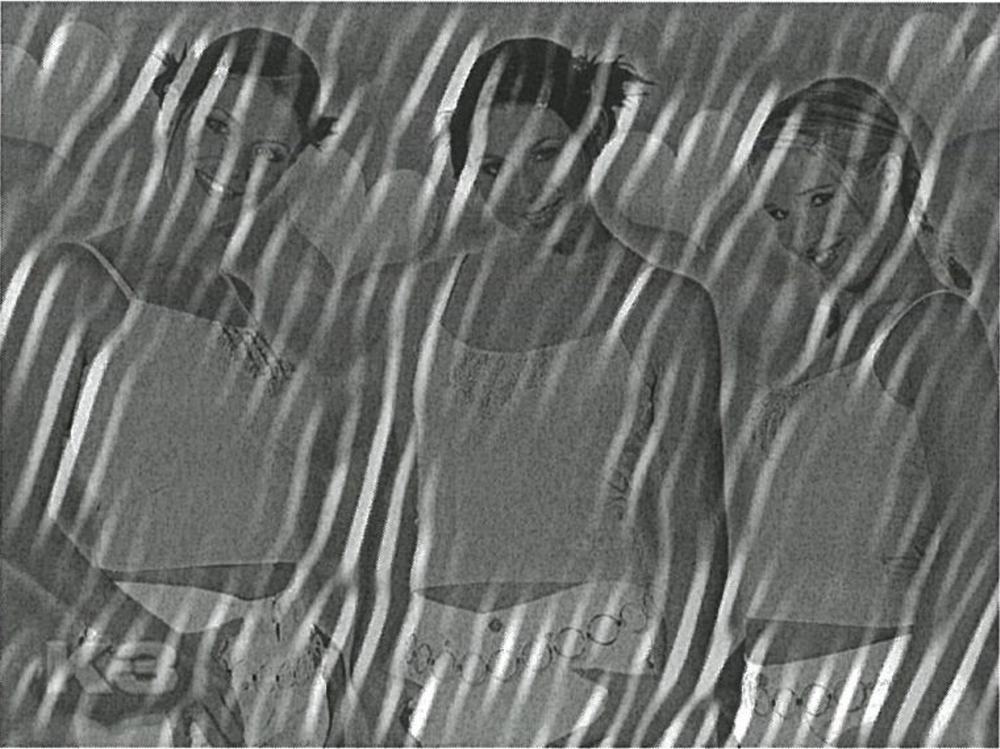
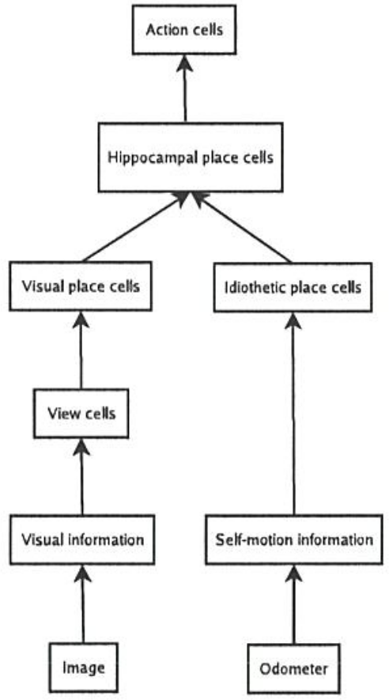
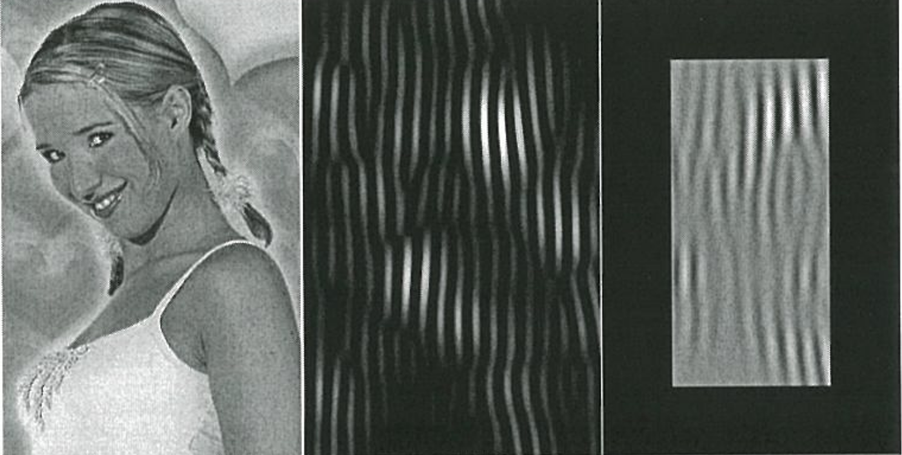
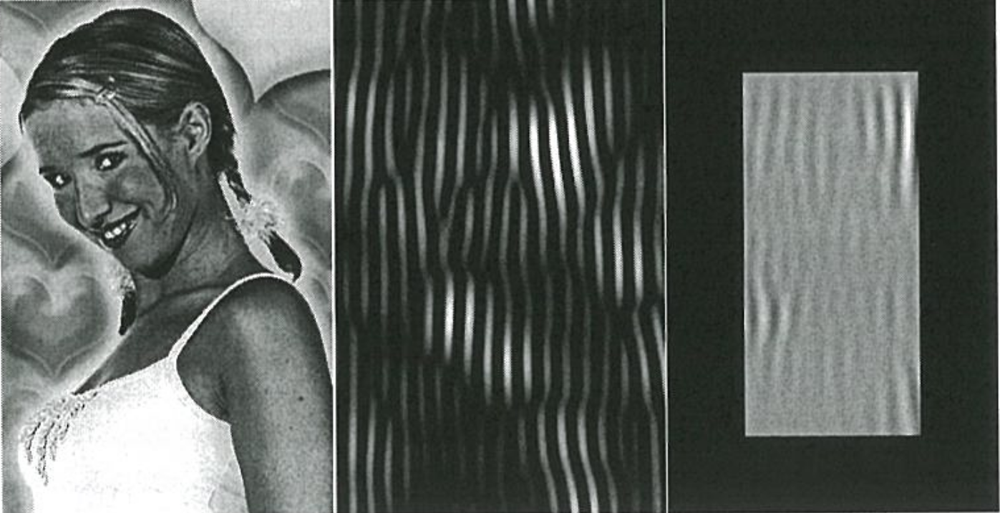
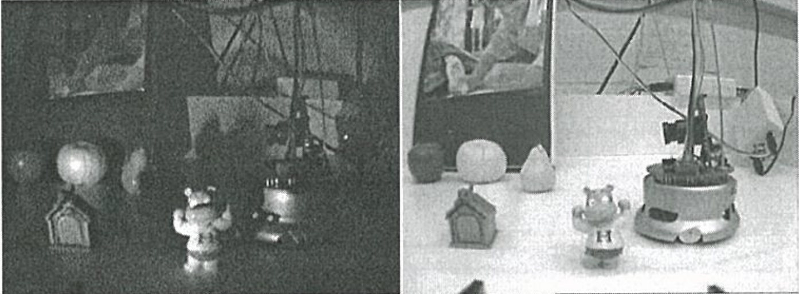
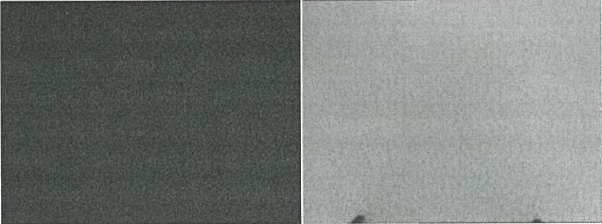
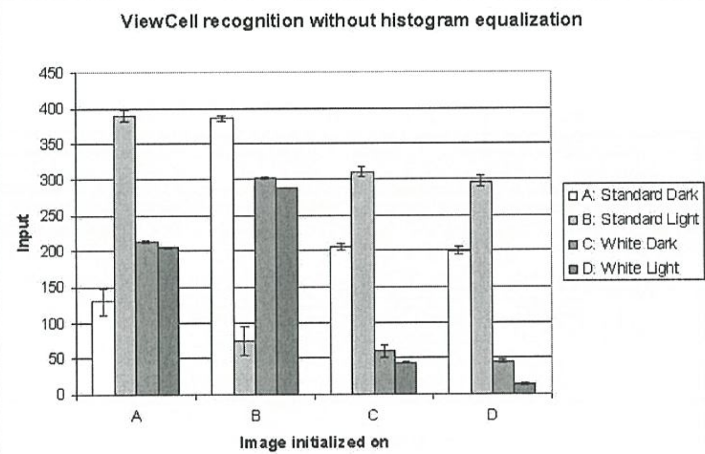
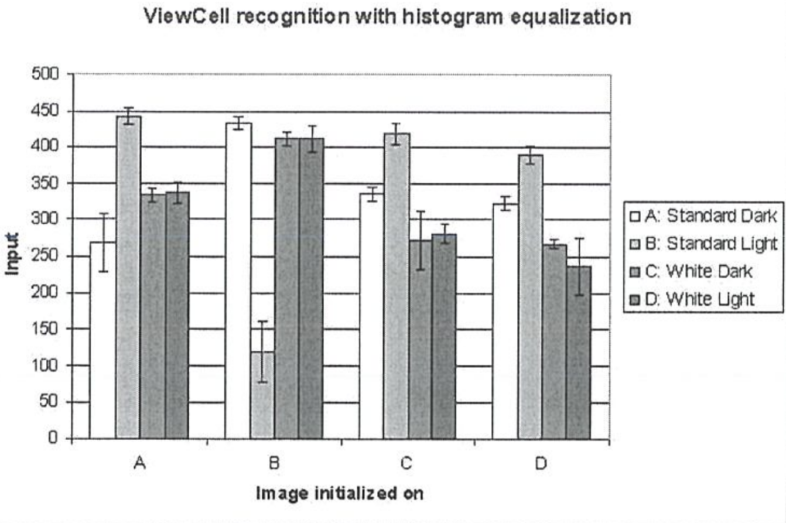

# the_bochum_project

MSc research project in Bochum

> Title image

> The neural network

> The effect of using histogram equalization (above: no, below: yes) before
> applying a Gabor filter

> The surroundings the neural nets were trained on.
> The bottom two served as controls

> The resulting recognition without (above) and with (below) using histogram equalization

